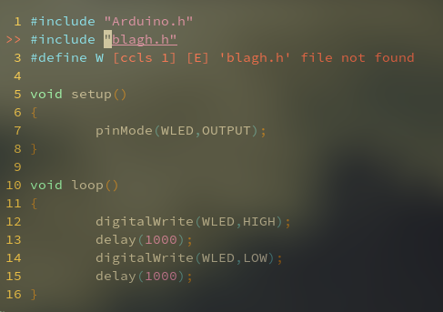

I'm intending this to be the start of a series documenting my journey from a traditional IDE to my own bare-metal toolchain for embedded development. Don't listen to what the elitists tell you -- you shouldn't have to leverage a degree in computer science or resign yourself to poor code syntax assistance in order to use Vim to develop software. In this article I'll be demonstrating how I switched from Visual Studio Code to Vim for my primary code editor, without losing any of the features that kept me on VSCode so long in the first place -- namely, robust code autocompletion and syntax checking along with the easy and powerful PlatformIO IDE extension for uploading and debugging my embedded projects. 

For the past six or seven months, I'd only used Vim as a drop-in ```nano``` replacement, which is to say I'd only break it out when I needed to edit config files or test a quick python project. I did like what it had to offer, and even ended up installing the excellent [vscode-neovim](https://github.com/asvetliakov/vscode-neovim) extension to get me Vim-like shortcuts and functionality in VSCode, but never considered it as a contender for an IDE replacement due to what I perceived as a lack of features. I did try out Vim plugins that added VSCode-like functionality such YouCompleteMe for code completion, but I always felt that I was losing something in the transition.

However, with my recent transition in other areas on my machine to less bloated solutions and terminal programs (changing desktop environments from GNOME to bspwm+polybar, using ncmpcpp+mopidy instead of the Spotify client for music, etc.), I wanted to take another stab at using Vim as my go-to editor for embedded development and general programming. However, I didn't want to sacrifice functionality at all, so I had a few important requirements:
- Ability to easily compile and upload my programs from either the command line or directly within Vim
- VSCode-like code completion and syntax checking with robust support for at least Python and C/C++

## Using the PlatformIO CLI Interface to Blink an LED
As it turns out, PlatformIO and its excellent documentation made this part of the process incredibly easy. I already knew PlatformIO had a command-line interface in addition to its GUI inside VSCode, but until I actually got into the docs and started using it I had no idea just how easy it was to use. In fact, project creation and setup was actually _faster_ using the command line. 

Much of what follows is straight from the exiting [Vim page](https://docs.platformio.org/en/latest/integration/ide/vim.html) on the PlatformIO docs, but I'll repeat here exactly how I set up my first project, a blink sketch for an Arduino Nano, using the PlatformIO Core and Vim. First, ensure you have the PlatformIO Core installed, either [by itself](https://docs.platformio.org/en/latest/core/installation.html) according to your system or automatically through VSCode (follow the instructions [here](https://docs.platformio.org/en/latest/core/installation.html#piocore-install-shell-commands) for the latter case), and obviously Vim as well.

Now to make the project. First run

```bash
$ mkdir my_project
$ cd my_project
```
to create the project directory. Now, from inside my_project, run
```bash
$ pio project init --ide vim --board nanoatmega328
```
to create the project itself. At this point, the PlatformIO project is technically complete, but you'll want to run ```vim Makefile``` and add the following contents to create a Makefile with some common PlatformIO commands you'll be using:
```makefile
# Uncomment lines below if you have problems with $PATH
#SHELL := /bin/bash
#PATH := /usr/local/bin:$(PATH)

all:
        pio -f -c vim run

upload:
        pio -f -c vim run --target upload

clean:
        pio -f -c vim run --target clean

program:
        pio -f -c vim run --target program

uploadfs:
        pio -f -c vim run --target uploadfs

update:
        pio -f -c vim update
```
Save with ```:wq```. After this is complete, let's look inside the project directory:
```bash 
[branalba@BrandonsThinkpad vim_pio_test]$ ls -a
.  ..  .ccls  .gitignore  include  lib  Makefile  .pio  platformio.ini  src  test
```
Most of this stuff will be familiar from VSCode PlatformIO projects, with the exception of that .ccls file (which will prove super useful later), and of course the Makefile we just added ourselves. We can immediately go into src/ and use vim to write the following Arduino sketch under main.cpp: 
```bash
$ vim src/main.cpp
```
```vim
  1 #include "Arduino.h"
  2 
  3 #define LED 13
  4 
  5 void setup()
  6 {
  7         pinMode(LED,OUTPUT);
  8 }
  9 
 10 void loop()
 11 {
 12         digitalWrite(LED,HIGH);
 13         delay(1000);
 14         digitalWrite(LED,LOW);
 15         delay(1000);
 16 }
```
Save this file, and now we're ready to upload! This is where we use that Makefile from earlier -- now you just need to run ```make upload``` to compile the code and upload it. I had an Arduino Nano already plugged in via USB, and PlatformIO automatically detected it, compiled, and uploaded my sketch. The whole process, from project creation to blinking an LED, took only a couple minutes and was increadibly straightforward. Make sure to keep that Makefile handy for new projects!

_Note: if you ever get a warning on Linux about udev rules for PlatformIO, run the following one-liner to install and update the [PlatformIO udev rules](https://docs.platformio.org/en/latest/faq.html#platformio-udev-rules) on your machine:_
```bash
curl -fsSL https://raw.githubusercontent.com/platformio/platformio-core/master/scripts/99-platformio-udev.rules | sudo tee /etc/udev/rules.d/99-platformio-udev.rules
```
There's a lot more in the way of Vim integration to explore with PlatformIO, including keyboard shortcuts and bash scripting, but for now I was really satisfied with how this little test came out. For me, at least, it was a more streamlined experience than the GUI version of the same process in VSCode, without sacrificing any features -- the PlatformIO GUI is completely based on the PlatformIO Core. The best part is, although I've been using it for Vim integration, all of what I just did is technically editor-agnosic. I could've used anything to write the Arduino sketch, and PlatformIO kept the project creation and upload experience powerful, easy, and, as we'll see in the next section, open-source and non-proprietary.

## Code Completion with cocs.nvim and CCLS
With PlatformIO sorted, the next step was to get Vim as functional as I needed it to be for writing programs. As I mentioned earlier, I didn't find the experience of YouCompleteMe, a popular Vim plugin for code autocompletion, to work well enough for my needs. Its suggestions weren't as good as VSCode's and it just felt less polished over all. In the effort to find a better plugin or solution to that problem, I basically stumbled onto [coc.nvim](https://github.com/neoclide/coc.nvim). Its tagline is literally "Make your Vim/Neovim as smart as VSCode," so I had a feeling this was going to be the answer to my problems. 

Installation was easy with a plugin manager for Vim -- I use Vundle, but it looks like any major plugin manager would work. I already had node.js installed on my system, but if you didn't have it you would need to install it. I dropped the line ```Plug 'neoclide/coc.nvim', {'branch': 'release'}``` into my .vimrc along with my other plugins, restarted Vim and ran ```:PlugInstall```. Finally, per the instructions, I copied a big block of config text from the README to the bottom of my .vimrc file. The Github says that you install language plugins on a case-by-case basis using either the command ```:CocInstall``` or adding some lines to a json file you can open by running ```:CocConfig```, so I went to test this first with Python. 

I ran ```:CocInstall coc-python```, let the installer do its thing, and then opened a test.py file to see how the autocomplete worked. This was where I ran into my first hiccup -- the plugin threw an error as soon as I started typing that made it pretty clear I needed to also install the Jedi language server for Python. I ran ```pip install -U jedi-language-server``` as per the instructions on the [jedi-language-server](https://github.com/pappasam/jedi-language-server), tried again, and this time it worked! Typing ```import``` gave me a list of suggestions for every library I had installed, and switching to a virtual environment in one of my existing projects added the relevant libraries to that list. Highlighting a suggestion to complete a function call also brought up a very detailed window describing that function -- all in all, identical to my experience in VSCode. I was also surprised by the syntax error checking, which worked so well that I was able to drop another one of my existing Vim plugins, Syntastic. I should note that there are two extensions coc.nvim offers for Python, coc-jedi and coc-python. I had them both installed for a while, and they seemed to function identically and (because?) they both apparently depend on Jedi. I ended up switching to coc-jedi because it was the extension recommended by the creators of Jedi on their Github page, but it shouldn't matter which one you choose.

_Note: Make sure you have the install location for the Python package binaries (for me it was ~/.local/bin) added to your PATH. It is not done by default on some machines, including mine, and may be the culprit if you experience issues with coc.nvim playing nice with language servers._

With that initial test out of the way, it was time the add the C/C++ autocompletion I needed to solidify my switch to Vim. Like with Python, there's a choice to make here -- coc.nvim has a built-in extension coc-clangd that uses clangd as the C/C++ language server, but had simple instructions for using ccls as an alternative, by making a small edit to the aforementioned json config file. This is where that .ccls file from the PlatformIO section comes it. This is functionality added by PlatformIO specifically for Vim and language server integration, an autogenerated project config file for ccls that informs it of all relevant include paths in the project, including folders in the project heirarchy itself and even the paths to the firmware drivers for the microcontroller. This is the one that PlatformIO generated automatically for my blink project:
```
1 clang
2 
3 %c -std=gnu11 -fno-fat-lto-objects -Os -Wall -ffunction-sections -fdata-sections -flto -mmc    u=atmega328p
4 %cpp -fno-exceptions -fno-threadsafe-statics -fpermissive -std=gnu++11 -Os -Wall -ffunction    -sections -fdata-sections -flto -mmcu=atmega328p
5 
6 -I/home/branalba/Nextcloud/project_files/vim_pio_test/include
7 -I/home/branalba/Nextcloud/project_files/vim_pio_test/src
8 -I/home/branalba/.platformio/packages/framework-arduino-avr/cores/arduino
9 -I/home/branalba/.platformio/packages/framework-arduino-avr/variants/eightanaloginputs
10 -I/home/branalba/.platformio/packages/framework-arduino-avr/libraries/EEPROM/src
11 -I/home/branalba/.platformio/packages/framework-arduino-avr/libraries/HID/src
12 -I/home/branalba/.platformio/packages/framework-arduino-avr/libraries/SPI/src
13 -I/home/branalba/.platformio/packages/framework-arduino-avr/libraries/SoftwareSerial/src
14 -I/home/branalba/.platformio/packages/framework-arduino-avr/libraries/Wire/src
15 -I/home/branalba/.platformio/packages/toolchain-atmelavr/lib/gcc/avr/5.4.0/include
16 -I/home/branalba/.platformio/packages/toolchain-atmelavr/lib/gcc/avr/5.4.0/include-fixed
17 -I/home/branalba/.platformio/packages/toolchain-atmelavr/avr/include
18 -I/home/branalba/.platformio/packages/tool-unity
19 
20 -DPLATFORMIO=50100
21 -DARDUINO_AVR_NANO
22 -DF_CPU=16000000L
23 -DARDUINO_ARCH_AVR
24 -DARDUINO=10808
25 -D__AVR_ATmega328P__
```
The reason this is great is because language servers don't automatically know all the include paths for a project, just the built-in libraries like stdio.h or math.h in C. To get proper syntax errors in Vim with ccls or clangd, I'd need to manually add include paths to config files every time I made a project. Although there are definitely good solutions out there to make this easier, the first major one just being able to stick a file like .ccls in every new project's root, native integration into PlatformIO just makes it so much easier.

What this means for the choice of coc.nvim extension is, naturally, that I chose ccls for my language server. I did need to install it using ```# pacman -S ccls``` (on Arch Linux), and edit the json file brought up by running ```:CocConfig``` in Vim: 
```vim
1 {
2         "languageserver": {
3                 "ccls": {
4                         "command": "ccls",
5                         "filetypes": ["c", "cc", "cpp", "c++", "objc", "objcpp"],
6                         "rootPatterns": [".ccls", "compile_commands.json", ".git/", ".hg/"]    ,
7                         "initializationOptions": {
8                                 "cache": {
9                                         "directory": "/tmp/ccls"
10                                 }
11                         }
12                 }
13         }
14 }
```
The above is copied directly from [this](https://github.com/neoclide/coc.nvim/wiki/Language-servers#ccobjective-c) page on the coc.nvim Github. 

At this point I restarted Vim for good measure and opened up the blink sketch from earlier. There were no immediate errors, and just to check I tried to import a bogus library into the sketch, saved, and was greeted with the following:



Syntax errors were working, and under further inspection the code completion was even suggesting libraries found under PlatformIO include paths! In my testing so far, all other types of code completion in C/C++ seem to be working exactly as I liked them in VSCode.

### Conclusion

There's absolutely nothing wrong with using an IDE or mainstream text editor as your development platform -- I definitely was a little skeptical going into this transition -- but hopefully this article helped demonstrate that those who do want to transfer don't have to lose functionality or the ability to make use of powerful, open-source extensions without jumping through dozens of config hoops. In my next article in this series, I'll be taking a look at doing STM32 development in Vim using STM32CubeMX to generate projects and handle compilation, as well as comparing a couple different standalone tools to flash and debug programs.